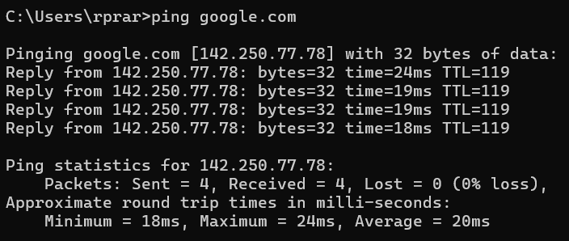
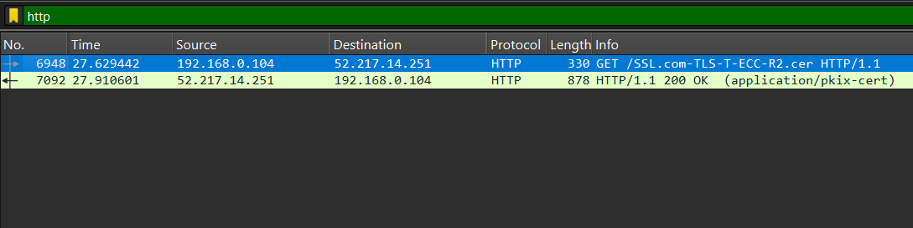
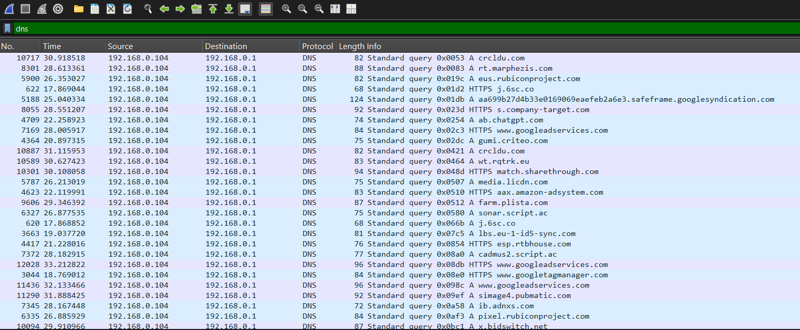
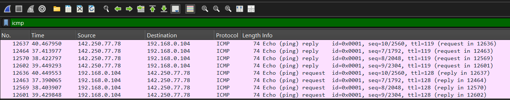
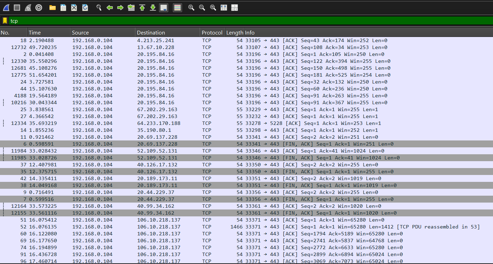
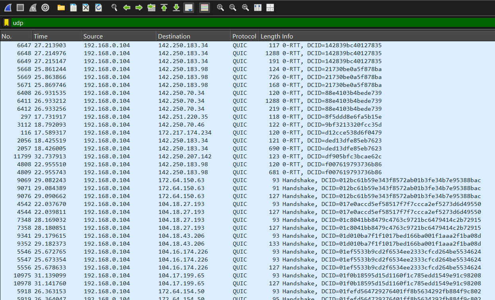
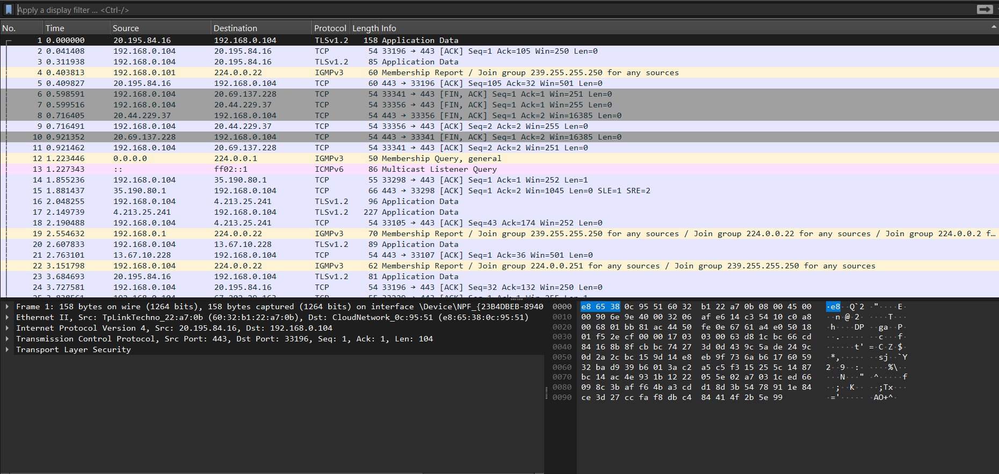

# Task 5: Capture and Analyze Network Traffic Using Wireshark

**Objective:** To capture live network packets and analyze basic traffic and protocol details.

---

### Tools
- **Wireshark** (version x.x.x)
- **Browser**: Chrome
- **Command Line**: `ping google.com`

---

### Steps

1. Install Wireshark and launched it.
2. Select the active network interface: **Wifi/Ethernet**.
3. Start packet capture and:
   - Open a browser and visited any website.
   - Ping Google using: `ping google.com`.
    
4. Stop the capture after 1-2 minute.
5. Apply protocol filters to analyze traffic:
   - `http` to view web activity
     
   - `dns` to view domain resolution
     
   - `icmp` to view ping requests
     
   - `tcp`
     
   - `udp`
     

---

### Protocols Identified

| Protocol | Packet No. | Source IP       | Destination IP  | Summary                          |
|----------|------------|------------------|------------------|----------------------------------|
| DNS      | 45          | 192.168.0.104    | 192.168.0.1    | Standard query 0xbd59 A in.search.yahoo.com   |
| HTTP     | 7092         | 52.217.14.251    |  192.168.0.104   | HTTP/1.1 200 OK  (application/pkix-cert)         |
| ICMP     | 12463        | 192.168.0.104    | 142.250.77.78  | Echo (ping) request  id=0x0001, seq=7/1792, ttl=128 (reply in 12464) |

[click here](report.pcap) for detailed report

